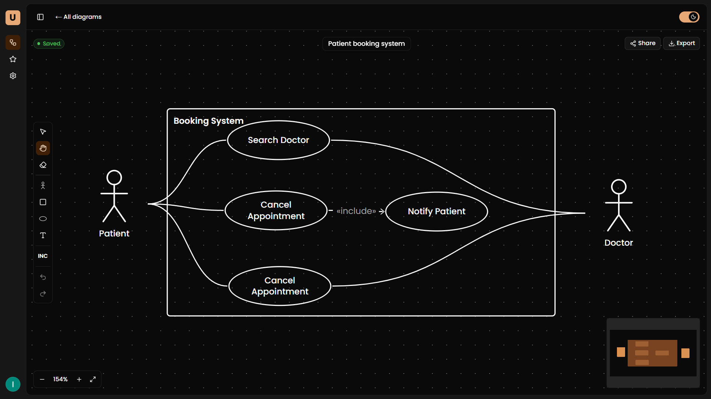
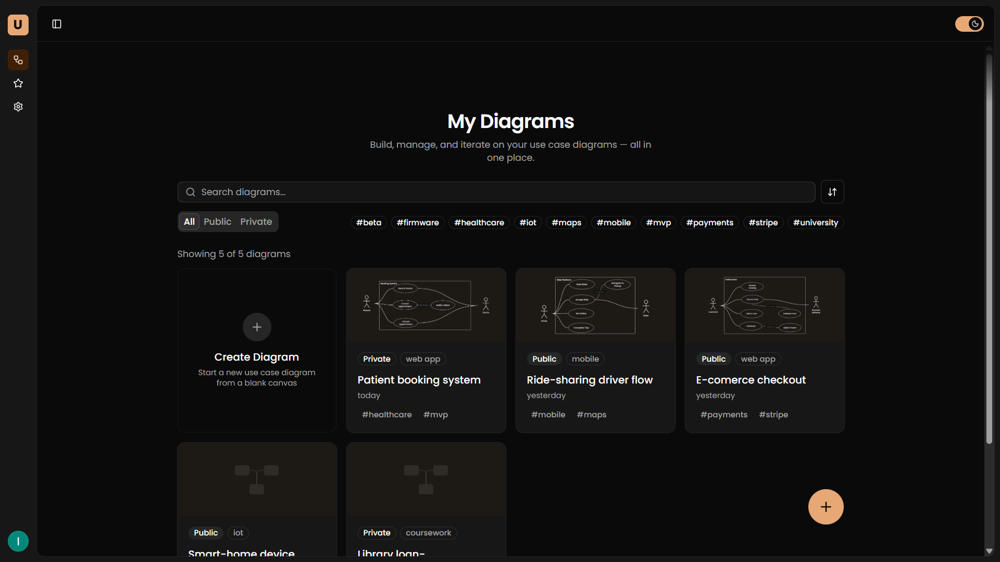

# UmiFy

**Web app for building UML use case diagrams.**

## Screenshots

 

## Features

- **Visual editor** — actors, use cases, system boundaries (React Flow)
- **UML edges** — association, include, extend, generalization
- **Undo / redo** and PNG/SVG export
- **Public share links** for read-only viewing
- **Auth** — GitHub, Google, guest sign-in (Auth.js v5)
- **Persistence** — save diagrams, favorites, search & filtering

## Tech stack

- **Framework:** Next.js 16 (App Router), React 19, TypeScript
- **UI:** Tailwind CSS 4, shadcn/ui, @xyflow/react
- **State:** Zustand, nuqs
- **Data:** Prisma + PostgreSQL, Auth.js v5, Zod
- **Testing:** Vitest, React Testing Library

## Getting started

> Requires Node.js 20+, pnpm, and a running PostgreSQL instance.

```bash
pnpm install
cp .env.example .env
pnpm db:migrate
pnpm dev
```

## License

See [LICENSE](LICENSE).
